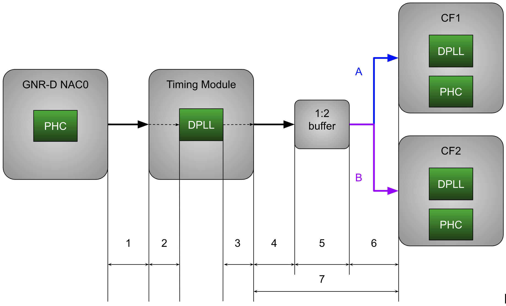

# Delay compensation model

This document proposes a layered model for phase delay compensation for implementation in precision timing operator.

JIRA: [https://issues.redhat.com/browse/CNF-20638](https://issues.redhat.com/browse/CNF-20638)	

# Introduction	

## Goals

1. The model is easy to understand, represent in configuration files (YAML) and implement in software  
2. The model should specify the way the delay information is provided for each route segment, since different segments of the route are under different responsibilities. For example, DPLL module delays can be provided by DPLL driver, NIC delays by NIC driver, routing delays by hardware manufacturers through BIOS, and external cables and custom adjustments by user through configuration files

## Approach

The approach proposed here is built on the top of three layers.

* **Topology** \-  the immutable physical graph of components and connections, establishing the structural "hardware truth"   
* **Physics** \- a layer on the top of the topology, which assigns specific latency values to different propagation segments   
* **Intent**  \- layer that defines the signal flows and delay compensation policies, decoupling physical reality from control logic 

This separation allows us to model passive nodes for total latency observability while flexibly assigning "compensation checkpoints" to neutralize accumulated delay at arbitrary stages of the signal path.

## 

## Illustrative example \- GNR-D Telecom Boundary Clock with follower NICS 
 
### 1\. Layer 1: Topology (The Connectivity)

This layer defines the static hardware inventory, wiring and directions. It answers the question “What connects to what”. We use graph theory terminology of nodes and edges. 

* **Nodes:**   
  * NAC  
  * Timing module input connector  
  * DPLL input pin  
  * DPLL output pin  
  * Timing module output connector  
  * Buffer / Splitter input pin  
  * Buffer / splitter output pin  
  * Carter flats  
* **Edges:**  
1. NAC to Timing Module routing / wiring.   
2. Timing module internal routing from the connector input pin to the DPLL input pin.   
3. Timing  module internal routing from the DPLL output pin to the connector output pin.   
4. Timing module to the Buffer / Splitter routing  
5. Internal Buffer / Splitter switching delay  
6. Buffer / Splitter to CF1 and CF2 delay. The delay is assumed to be identical on path A and path B.  
7. Overall delay from Timing module output connector to CF that can be modeled for simplicity. Since neither CF nor Buffer / Splitter are manageable, the entire Edge 7 is a sum of edges 4, 5 and 6\. 

### 2\. Layer 2: Physics (The Latency)

This layer maps measurable physical properties to the topology. It answers "What is the cost of traversal?",  and also “Who is responsible to measure and provide this number?” 

| Edge | Value | Note |
| :---- | :---- | :---- |
| NAC to Timing Module PTP phase delay | 5700ps (Dell spreadsheet. probably includes the timing module) 2185ps (Intel pres) \*Note 1 | Responsibility \- hardware manufacturer (DELL) Exposed by? |
| Timing module internal routing from the connector input pin to the DPLL input pin | 129ps (Intel pres) \*Note 1 | Responsibility \- timing module manufacturer (Microchip) Exposed by the timing module driver? |
| Timing  module internal routing from the DPLL output pin to the connector output pin | 152 (Intel pres) \*Note 1 |  |
| Overall delay from Timing module output connector to CF | 6732 (Dell spreadsheet, probably includes the timing module above) \*Note 1 | Responsibility \- hardware manufacturer (DELL) Exposed by? |
| Note 1: Specific delays and topology are subject to change per platform generation |  |  |

#### 

### 3\. Layer 3: Intent (The Compensation Strategy)

This layer defines how the system compensates for the effects introduced by physics. 

We define a **Route** (the specific sequence of interest) and a **Compensation Strategy**.

| Route | Strategy | Designated compensator | Configuration |
| :---- | :---- | :---- | :---- |
| NAC to DPLL input | Input side compensation | DPLL REF0 input \*Note 1  | User space will sum 5700ps and 129ps, and dial \-5829 ps of phase adjustment (rounded to the nearest phase adjustment granularity) to the designated compensator |
| DPLL to CF (unmanaged inputs) | Output side compensation | DPLL OUT5 output \*Note 1 | User space will sum 6732ps and 152ps, and dial \-6884 ps of phase adjustment (rounded to the nearest phase adjustment granularity) to the designated compensator |
| Note 1: Specific numbers, labels and pins are subject to change per platform generation |  |  |  |

#### 

# Information model

```json
# 1. Inventory - static phase transfer nodes
components:
  - id: "NAC0 PTP phase output"
  - id: "Timing module input connector"
  - id: "DPLL 1kHz input"
    # compensationPoint is only required for compensators, see below
    compensationPoint: 
      name: "REF0"
      type: dpll 

  - id: "DPLL ePPS OUT5"
    compensationPoint: 
      name: "OUT5"
      # type can be either "dpll" or in the future (only for non-dpll 
      # compensation points) "FSWrite" (in which case the path and formatting should be configured).
      # optional, default - "dpll".
      type: dpll

  - id: "Timing module ePPS out"
  - id: "Carter Flats ePPS in"


# 2. Topology: Physical connections (graph edges)
connections:
  - from: "NAC0 PTP phase output"
    to: "Timing module input connector"
    # When provided by the platform, this part specifies how to get the delay
    getter:
      FSRead:
        path: "/sys/class/.../.../delay"
    # Pre-coded fallback default for when not provided by the platform
    delayPs: 5700
# Etc.
  - from: "Timing module input connector"
    to: "DPLL 1kHz input"
    delayPs: 129
  - from: "DPLL ePPS OUT5"
    to: "Timing module ePPS out"
    delayPs: 152
  - from: "Timing module ePPS out"
    to: "Carter Flats ePPS in"
    delayPs: 6732

# 3. Logic: Where do we compensate for the delay
routes:
  - name: "NAC PTP to DPLL"
    sequence: ["NAC0 PTP phase output", "Timing module input connector", "DPLL 1kHz input"]
    compensator: "DPLL 1kHz input"
    # default behavior is static, omit if empty
    # the behavior is only needed when compensator is not DPLL and 
    # dynamic interconnection change is required (and supported)
    # In the latter case the behavior should reference the condition name 
    # from the HardwareConfig behavior section
    behavior: static
    # User adjustment is 0 by default. Provide a way to adjust through a configmap
    userAdjustmentPs: -3456

  - name: "DPLL to CF"
    sequence: ["DPLL ePPS OUT5", "Timing module ePPS out", "Carter Flats ePPS in"]
    compensator:"DPLL ePPS OUT5"
```

# Flow

The procedure below is invoked on every PtpConfig or HardwareConfig resource (re)configuration

```
for each connection in connections:
    initialize delays (from platform values or overrides)

for each route in routes:
    compensation = sum(segment.cost for segment in route.sequence)
    compensation += userAdjustmentPs

    for each component in components:
        if component.ID == route.compensator.ID:
            compensationPoint = {
                name: component.compensationPoint.name,
                type: component.compensationPoint.type
            }
            break

    if route.behavior == STATIC:
        apply compensation to compensationPoint (by name and type)
  
```

